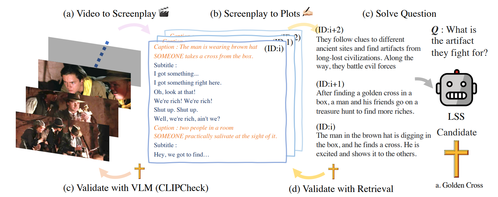

# Long Story Short: a Summarize-then-Search Method for Long Video Question Answering

This repository contains the code for our BMVC 2023 paper:
***Long Story Short: a Summarize-then-Search Method for Long Video Question Answering*** <br>
Jiwan Chung and Youngjae Yu <br>



## Installation

Install the required python packages.

```
pip -r requirements.txt
```

For CLIPCheck, we use the Jax-port of CLIP. Configure your environment following [Guide](https://github.com/google/jax) should you want to use GPUs for jax computation.

```
pip -r requirements_clipcheck.txt
```

## Data Preparation

```
mkdir data
```

- MovieQA
    - Contact the dataset maintainers and get the following annotations:
        - `data/movieqa/matidx`
        - `data/movieqa/shot_boundaries`
        - `data/movieqa/subtt`
        - `data/movieqa/MovieQA_benchmark/data/qa.json`
        - `data/movieqa/MovieQA_benchmark/data/splits.json`
        - `data/movieqa/MovieQA_benchmark/clip_filenames.txt`
    - For CLIPCheck, contact us to get pre-extracted video frame CLIP features.
        - `data/movieqa/frame_clip`

- DramaQA
    - Contact the dataset maintainers and get the following annotations:
        - `data/dramaQA/DramaQA/AnotherMissOhQA_train_set.json`
        - `data/dramaQA/DramaQA/AnotherMissOhQA_test_set.json`
        - `data/dramaQA/DramaQA/AnotherMissOhQA_val_set.json`
        - `data/dramaQA/DramaQA/AnotherMissOh_script.json`
        - `data/dramaQA/DramaQA/AnotherMissOh_Visual.json`
    - For CLIPCheck, contact us to get pre-extracted video frame CLIP features.
        - `data/dramaQA/DramaQA/frame_clip`

- PororoQA (tbu)

## Processing

```
cd code
```

All processing scripts accept `--dataset` parameter to designate the data to process.
Supported datasets:
  - `pororoqa`
  - `tvqa`
  - `movieqa`
  - `dramaqa`

We rely on OpenAI API for GPT usages. Update `secrets.yml` with your openai key before running any command below.

1. Getting plot summaries
  - `python get_base_plot.py`

2. Running QA given the extracted plots
  - `python get_qa.py`

3. Visual checking the QA data (CLIPCheck)
  - You should extract the video features for CLIPCheck.
    - Currently, we assume the raw videos are stored in google storage (`gs://`)
    - Then, you can run the following to get the required features.
        ```
        cd code/features
        python extract_clip.py --bucket_name gs://$GOOGLE_STORAGE --dataset $DATASET
        ```
    - Alternatively, contact us to get the required features. Note that we do not claim any rights to the data, so you should already have the raw data access by asking the original maintainers.
  - `python vis_check.py`

4. Reporting QA Accuracy
  - `python calc_acc.py`

# Contact

[jiwan.chung.research@gmail.com](jiwan.chung.research@gmail.com)
